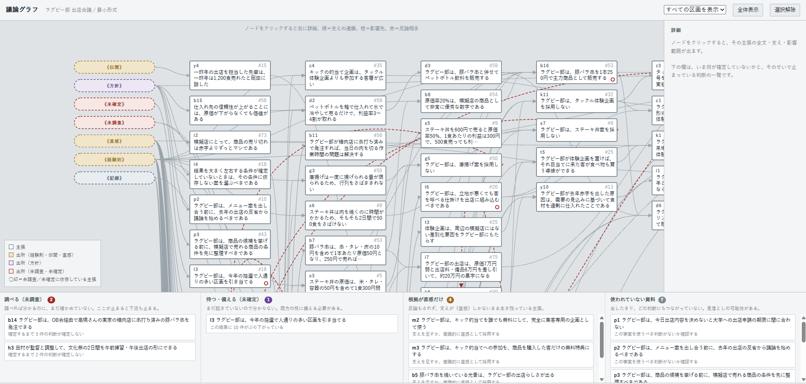
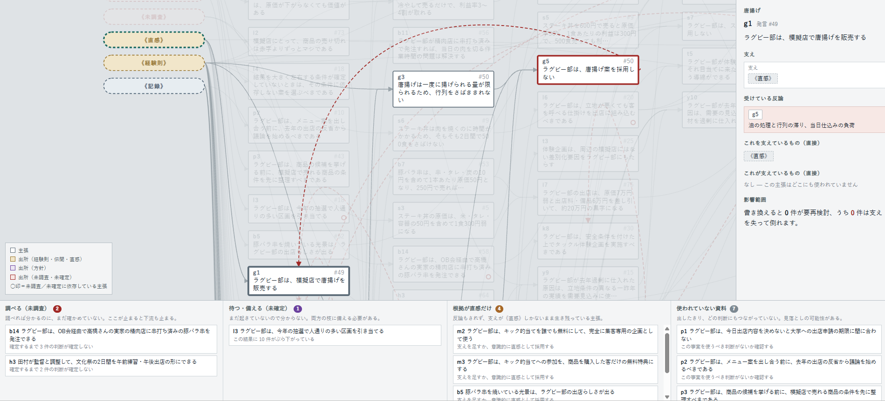

# 議論グラフ（構想段階）

## 概要

日報・議事録・報告書のように継続的に蓄積されるテキストを、**論理構造を保持した形で永続化する**ための試作実装です。単一のHTML（エイチティーエムエル）ファイルで動作し、外部依存はありません。

情報を相互に関連付けて検索可能にするだけであれば GraphRAG（グラフラグ）で足ります。ただし GraphRAG のグラフはエンティティ（実体）間の共起・関係を表すものであり、辺の意味は「関連がある」に集約されます。クエリ時に関連文書を引き当てる用途には十分ですが、**辺が論理的な含意を持たないため、前提が変わったときに何が成り立たなくなるかを計算できません。**

本試作のグラフは辺を論理関係（支持・反論）に限定し、ノードを命題に限定しています。これにより以下が計算可能になります。

- ある前提が偽になったとき、連鎖的に成り立たなくなる主張の集合
- 未確定の情報に依存しているために現時点では確定できない判断の集合
- 記録されているが、いかなる判断にも接続されていない事実の集合
- 各判断が、どの種類の根拠（一次資料／伝聞／経験則／直感／価値判断）に到達するか

意図しているのは、AI が受動的な検索インタフェースではなく、蓄積された状態を解釈して「次に議論すべきこと」「次に検証すべきこと」を能動的に提示する主体として機能することです。データモデルの設計方針は一貫して**解釈可能性の優先**であり、表現力や記述の簡便さはそれに従属させています。

設計がこの形に至るまでの経緯、検討した代替案とその棄却理由は [HISTORY.md](HISTORY.md) に分離しています。本書には現時点で決定している事項のみを記載します。

## イメージ図



*全体表示。左端の破線ピルが出所ノード、右へ向かうほど推論の深い主張。下部が NextAction 4列。*



*ノード選択時。選択ノードの上流・下流・反論相手だけを残し、範囲外を不透明度 0.16 まで減光する。右パネルに支え・反論・影響範囲を表示。*

## 動作環境と操作

構想段階なのでファイルをブラウザで開くだけです。ビルド・サーバー・パッケージ管理は不要です。

| 操作 | 動作 |
|---|---|
| ドラッグ | 平行移動 |
| ホイール | 拡大縮小（0.18〜2.6倍） |
| ノードのクリック | 選択。右パネルに詳細を表示し、関連ノードを着色 |
| ヘッダーのセレクト | 話題単位の絞り込み |

選択時の着色は、緑＝支えの連鎖（上流）、橙＝影響先（下流）、赤＝反論関係にあるノードです。無関係なノードは不透明度 0.16 まで落とします。

---

# データモデル仕様

## ノード

```
node       : { id, text, say? }
sourceNode : { id, text, src: true }
```

| フィールド | 型 | 必須 | 内容 |
|---|---|---|---|
| `id` | string | ○ | 一意識別子。接頭辞は可読性のための慣習であり、意味解釈には用いない |
| `text` | string | ○ | 命題の全文。1文・1結論・主語明示 |
| `say` | string | | 出所の位置（発言番号）。トレーサビリティ（追跡可能性）用 |
| `src` | boolean | | 出所ノードであることを示す。固定語彙のノードのみ |

`text` に関する制約は3点です。

1. **1ノード＝1結論。** 結論を2つ含む文は分割する
2. **主語・述語・目的語を明示する。** ノード単体で意味が確定すること
3. **条件とスコープを文中に埋め込む。** 「飲料は売れない」ではなく「気温が低い日は、屋外で販売される冷たい飲料の需要が落ちる」

3点目を怠ると、両立可能な命題どうしが衝突していると誤判定されます。

## エッジ

```
edge : { id, kind, from: string[], to: string, note? }
kind : "support" | "rebut"
```

| フィールド | 型 | 必須 | 内容 |
|---|---|---|---|
| `id` | string | ○ | 一意識別子。エッジ自体を参照対象とする将来拡張のために必須 |
| `kind` | enum | ○ | `support`（支える）または `rebut`（もう成り立たなくする） |
| `from` | string[] | ○ | 始点ノードIDの配列。**配列内は連言** |
| `to` | string | ○ | 終点ノードID |
| `note` | string | | `rebut` の場合、何を否定しているか |

## 連言の意味論

`from` が配列である理由は、「全部揃って初めて支える」を表現するためです。

```
{from: ["a","b","c"], to: "x"}       a ∧ b ∧ c → x       （連言）

{from: ["a"], to: "x"}
{from: ["b"], to: "x"}               a → x,  b → x        （独立）
```

| | 構成要素が1つ偽になったとき |
|---|---|
| 連言 | 結論も倒れる |
| 独立 | 結論は残る（支持の強度が下がるのみ） |

この区別は表示上の差ではなく、崩壊計算の結果そのものを変えます。サンプルデータでは 115 本の support エッジのうち 37 本が連言エッジです。

判定基準は「その1つが崩れたら、この結論も崩れるか」の一問です。**判定できない場合は独立にします。** 連言は波及範囲を過大に算出するため、誤って連言にすると無関係な再検討が大量に発生します。

## 出所語彙

議論の外部から持ち込まれた命題は、固定語彙のノードから `support` を受けます。**語彙は7語で固定し、拡張しません。**

| id | 意味 | 典型的な発話 |
|---|---|---|
| `記録` | 一次資料、規約、その場で確認した事実 | 「売上集計では820食」 |
| `伝聞` | 人づてに聞いた話。一次資料ではない | 「先輩が1,200食売れたと言っていた」 |
| `経験則` | 一般化されているが、この場では検証されていない | 「飲食は9割立地と言われる」 |
| `直感` | 根拠が提示されていない | 「絶対人集まりますって」 |
| `方針` | 価値判断。真偽の対象ではない | 「売り切れは赤字よりマシ」 |
| `未調査` | 情報は存在するが取得していない | 「精肉店に頼めるか未確認」 |
| `未確定` | 事象が未発生であり、誰も知り得ない | 「抽選は来週」 |

`伝聞` を `記録` から分離しているのは、サンプルデータにおいて**口頭の証言1件が2年分の意思決定の起点になっている**ためです。統合すると、この依存経路が一次資料由来のものと区別できなくなります。

`未調査` と `未確定` の分離は、次アクションが「調べる」と「両方の枝に備える」で異なることによります。ただし同梱マニュアルではこの2語を `情報不足` に統合しており、コード側が追いついていません（→ [仕様と実装の差分](#仕様と実装の差分)）。

## 記述規則

疑問文はそのままではノードにできません。依存の性質に応じて2形式に変換します。

| 議論が依存しているもの | 変換形式 | 例 |
|---|---|---|
| その答えが**真であること** | 肯定の平叙文（条件形） | 「精肉店に串打ち済みで発注できる」 |
| 答えが**出ていないこと** | 「〜か、まだ分からない」 | 「区画が良いか悪いか、まだ分からない」 |

判定手続きは「**答えがどちらに転んでも、その判断の理由が消えるか**」の一問です。消えるなら後者の形式を用います。

```
[l5] どの区画に当たっても成立する案を選ぶべきである
```

| 抽選の結果 | l5 はどうなるか |
|---|---|
| 良い区画 | 立地を活かす案が優る。l5 は不要 |
| 悪い区画 | 悪条件に特化すべき。l5 は不要 |

両方で不要になるため、l5 の支えは「良い区画に当たる」（条件形）ではなく「区画が良いか悪いか、まだ分からない」でなければなりません。

推論の橋（前提から結論への一般則）は独立したノードとして記述します。判定は「〜のため」「〜だから」「〜なので」という接続詞の有無です。

```
[n1] 雨が降ると気温が下がる
[n2] 気温が下がるとドリンクは売れない      ← 反論の対象にできる
[n3] 雨が降るとドリンクは売れない  ← {n1, n2}
```

橋を分離することで、「結論そのものの否定」と「論拠の掘り崩し」が、エッジ種を増やさずに刺す先の選択として区別できます。

## 保持形式と不変条件

ノードとエッジは**完全に別配列**で保持し、相互参照はIDのみで行います。

```js
const N = [ {id, text, say}, ... ];              // 関係情報を一切持たない
const E = [ {id, kind, from, to, note}, ... ];
```

満たすべき不変条件は次の5つです。現在はいずれも実装されておらず、手書き時の規律として運用しています。

| 不変条件 | 違反時の影響 |
|---|---|
| `from` / `to` が実在するIDを指す | 参照切れ。崩壊計算が不正確になる |
| `from` にはIDのみが入る（自然言語の混入がない） | **全派生計算が停止する** |
| 出所ノードが `to` に現れない | 出所が支えられるという意味不明な構造になる |
| 出所ノードの `id` が固定語彙に含まれる | 検出条件が語彙と一致しなくなる |
| 閉路が存在しない | 崩壊計算の不動点反復が意図しない挙動を示す |

2番目が本試作全体で最も重要な制約です。データモデル上の他の制約の大半は、これを守りやすくするために存在します。

---

# 派生計算

すべて到達可能性と空欄判定のみで計算され、自然言語の意味解釈を使用しません。これは意図的な制約です。意味解釈を導入すると、検出結果の妥当性が説明できなくなり、誤検出の原因が特定できなくなります。

## 索引の構築

```js
SUP[x]    // x への support エッジの from 配列のリスト（グループのリスト）
OUT[x]    // x を from に含む support エッジの to のリスト
REBin[x]  // x を to とする rebut エッジ
REBout[x] // x を from とする rebut エッジ
```

いずれも起動時に `E` から構築する索引であり、保存対象ではありません。

## 基本計算

| 名称 | 定義 | 意味 |
|---|---|---|
| `up(x)` | `SUP` を辿った推移閉包 | x の根拠の連鎖 |
| `down(x)` | `OUT` を辿った推移閉包 | x を書き換えたとき要再検討となる範囲 |
| `collapse(x)` | 下記の不動点反復 | x が倒れたとき連鎖的に倒れるノードの集合 |
| `BLOCK[x]` | `down("未調査")` と `down("未確定")` への所属 | 未確定情報への依存。図では○印で表示 |

## 崩壊判定

```
ノード x が倒れる
  ⟺ SUP[x] が空でなく、
     かつ SUP[x] のすべてのグループについて、
     そのグループ内に倒れたノードが少なくとも1つ含まれる
```

`SUP[x]` が空のノード（出所ノード、および支えを持たない孤立ノード）はこの規則では倒れません。

```js
function collapse(seed){
  const dead = new Set([seed]);
  let changed = true;
  while (changed) {
    changed = false;
    for (const x of N) {
      if (x.src || dead.has(x.id)) continue;
      const groups = SUP[x.id];
      if (!groups.length) continue;
      if (groups.every(g => g.some(p => dead.has(p)))) {
        dead.add(x.id);
        changed = true;
      }
    }
  }
  dead.delete(seed);
  return dead;
}
```

ノード数を n として、最悪計算量は O(n²) です。本試作の規模（122ノード）では問題になりません。

## 選択時の関連範囲

選択ノード x に対し、以下の和集合を関連範囲とし、範囲外を減光します。

```
{x} ∪ up(x) ∪ down(x) ∪ foes(x) ∪ ⋃_{f ∈ foes(x)} up(f)
```

`foes(x)` は x と rebut で直接つながるノード（双方向）です。反論相手の上流を含めるのは、「なぜこの主張が否定されているのか」を根拠まで辿れるようにするためです。

---

# 検出項目

## NextAction（ネクストアクション）4列

下パネルの構成が、本試作の目的をもっとも直接的に表現しています。

| 列 | 抽出条件 | 併記情報 |
|---|---|---|
| 調べる（未調査） | `OUT["未調査"]` のうち出所ノードでないもの | `down(x)` の件数 |
| 待つ・備える（未確定） | `OUT["未確定"]` のうち出所ノードでないもの | `down(x)` の件数 |
| 根拠が直感だけ | `SUP[x]` の全要素が `直感` のみ、かつ `REBin[x]` が空 | — |
| 使われていない資料 | `OUT[x]` が空、`REBin[x]`・`REBout[x]` が空、`SUP[x]` の全要素が出所ノード（`直感` を除く） | — |

3列目で `REBin[x]` が空であることを条件にしているのは、否決された提案を除外するためです。提案は多くの場合 `直感` のみに支えられますが、反論を受けて倒れているものは対処が不要です。

4列目で `直感` を除外しているのは、採用されなかった提案（反論も受けず、単に選ばれなかったもの）と、使われていない事実とを区別するためです。

## 検出例

サンプルデータで4列目に出現する項目の1つです。

> **j7：** 大学は、模擬店の火気使用を指定区画のみに限り、消火器の設置を義務づけている

発言45で読み上げられて以降、この規約はどの判断の前提としても参照されていません。一方で主力商品として決定された豚バラ串は焼き台を使用し、さらに「どの区画に当たっても成立する案を選ぶ」という前提（l5）が立っています。火気使用が指定区画に限られるなら、この2つは両立しない可能性があります。

会議中、この衝突は誰も指摘していません。検出に使用したのは「出力エッジがゼロ、反論の授受なし、支えが `記録` のみ」という構造条件のみで、文の意味は解釈していません。

---

# 画面仕様

| 領域 | 内容 |
|---|---|
| ヘッダー | 話題フィルタ、全体表示、選択解除 |
| 中央 | グラフ本体 |
| 右（幅340px） | 選択ノードの詳細 |
| 下（高さ216px） | NextAction 4列 |

## グラフの描画規則

| 要素 | 描画 |
|---|---|
| 主張ノード | 白の矩形。ID・発言番号・本文（最大3行、超過は省略） |
| 出所ノード | 破線の角丸ピル。語彙ごとに配色 |
| 未確定依存 | ノード右下に赤の中空円 |
| support（単一） | 灰色のベジェ曲線。始点＝右辺中央、終点＝左辺中央、終端に三角矢尻 |
| support（連言） | 各始点から点へ細線で集約し、点から1本を終点へ |
| rebut | 赤の破線。始点＝右辺中央、終点＝**上辺中央** |

support と rebut は**着地する辺**で区別します。左辺への着地が支持、上辺への着地が反論です。色や線種に依存せずに読み取れます。

rebut の弧の高さは、始点と終点が属する列範囲内の全ノードの上端より上に取ります。これにより、長距離の戻り経路がノードの背後に隠れません。

## 右パネル

選択ノードについて、全文、支え（連言は箱でまとめて表示）、確定していない依存、受けている／出している反論、直接の上流・下流、影響範囲（`down` の件数と `collapse` の件数）を表示します。IDチップはクリックで遷移します。

---

# レイアウトアルゴリズム

1. 各ノードの深さを、支えの最長経路として算出する（出所ノードは0）
2. 深さごとに列を構成する
3. 各列内の縦順を、前提の重心（barycenter）で18回反復ソートし、交差を削減する
4. 列幅170px、列間隔74px、ノード間隔13pxで配置する

閉路が存在する場合、深さ算出時に訪問済みノードを0として扱います。**検出も警告も行いません。** 不変条件の検査が未実装であることに起因する既知の欠陥です。

---

# サンプルデータ

大学ラグビー部の文化祭出店を決める会議（発言1〜82）の書き起こしを構造化したものです。

| 項目 | 数 |
|---|---|
| ノード | 122（主張115・出所7） |
| エッジ | 124（support 115・rebut 9） |
| 連言エッジ | 37 |
| 最大深さ | 11 |

## 構造から読み取れること

| 観測 | 内容 |
|---|---|
| `経験則` への到達率 72% | 全主張の約7割が、検証されていない一般化に依存している。一次資料（`記録`）は12件のみ |
| `伝聞` 1件の支配 | 「一昨年の先輩が1,200食売れたと言っていた」→ 去年の過剰仕入れ → 今年の仕入れ方針、という経路。口頭の証言1件が2年分の意思決定の起点になっている |
| rebut 9本中8本が却下で終了 | 否定が代案を生んだのは1回のみ（「当日の手切りは時間的に無理」→「串打ち済みで発注する」） |
| `未調査` への依存 6件 | 主力商品の決定（b16）が、未実施の1件の問い合わせ（b14）に依存している |
| 未接続の記録 7件 | j7（火気規制）、h7（1年生全員がシフトに入れる）など |

いずれも構造条件のみで算出しており、議事録を読む作業とは独立しています。

---

# 仕様と実装の差分

同梱のマニュアル v0.3 は本実装より後に整備されており、以下の点で実装が追いついていません。

| 項目 | マニュアル | 実装 |
|---|---|---|
| 出所語彙 | 6語（`未調査` と `未確定` を `情報不足` に統合） | 7語 |
| `at`（有効日） | ノード・エッジの必須フィールド | なし |
| 時点復元 | `at <= T` でフィルタして再計算 | 未実装 |
| 追記のみの運用 | 必須（時点復元の成立条件） | 規約として未明示 |

## 出所語彙の統合について

マニュアルが `未調査` / `未確定` を `情報不足` に統合した理由は、**会話から両者を判別できない場合が多く、記録者に判定を強いるべきではない**という点にあります。判別可能になった時点で、語彙ではなくノードとして表現します。

```
[x2]  区画が良い場所か悪い場所か、まだ分からない        ←《情報不足》
[x2a] 抽選は来週なので、現時点では誰にも分からない      ←《記録》 → x2 を支える
```

`x2a` の有無で「待つしかないもの」と「調べれば済むもの」が区別されます。語彙を増やさずに済み、かつ記録時点での判定を強制しません。

## 時点復元について

`at` を両者に付与し、追記のみで運用すれば、`at <= T` でフィルタして再計算するだけで任意時点の判断状態が復元できます。

```js
function view(N, E, T){
  const nodes = N.filter(x => x.src || x.at <= T);
  const edges = E.filter(e => e.at <= T);
  const seeds = edges.filter(e => e.kind === "rebut").map(e => e.to);
  return collapse(nodes, edges, seeds);
}
```

この場合 `rebut` の意味は「その主張は偽である」ではなく「**その主張はもう成り立たない**」と定義されます。反証と失効を区別せず、どちらであったかは `at` の差から判断します。

成立条件は、既存のノード・エッジを書き換えず削除しないこと（追記のみ）の1点です。

---

# 制約と未解決

## A. 実装により解決するもの

| 項目 | 現状 |
|---|---|
| 時点復元 | `at` 未実装 |
| rebut を反映した現在状態の表示 | **rebut は注釈と着色のみで `collapse` に入力されていない。倒れているはずのノードが生存して表示される** |
| 不変条件の検査 | 未実装（参照整合・閉路・出所の位置・語彙） |
| データの外部化・追記・編集 | HTML内に直書き。追記のたびにファイルの編集が必要 |
| 検索、言い換えの同定 | 未実装。規模の増大に伴い重複が必然的に発生する |

## B. 設計上の決定を要するもの

| 項目 | 論点 |
|---|---|
| 再反論による復活 | 反論した側が倒れても、刺された側は倒れたまま。研究や長期の議論では頻出する |
| 主張以外の情報 | 補足・具体例・解釈・比喩・TODO（トゥードゥー）・定義・手順といった、真偽を問えない参照情報の置き場所がない |
| 確信の度合い | 「たぶん」も「確実に」も断言と同一に扱われる。報告書ではこの形式が最も多い |
| 弱める関係 | 「ただし〜」という限定が、反論（相手が倒れる）か無記録かの二択しかない |
| 状態の多値化 | 生死の2値のみ。保留、完了、撤回といった中間状態を表現できない |
| 明言されない方向転換 | 明示の rebut がない限り古い前提が生存し続け、時間経過とともに実態と乖離する |
| 排他 | 「Aである」と「Aでない」が両立しないことを機械が読み取れない。相互に rebut を張ることで近似できるが、排他とは解釈されない |

## C. 運用・入力側の設計

| 項目 | 論点 |
|---|---|
| 記述の主体 | 現状は人間による事後整理を前提としている。AIが会話中に記述する運用にする場合、**発話者の主張とAIの推測を必ず区別する機構**が必要 |
| 断片メモの扱い | 「lr 1e-4 収束遅い」のような断片は、主語を補えば「言われていないことを書く」違反、補わなければノード化不能 |
| 文脈の粒度 | 単一会議であれば1グラフで足りるが、1年分を扱う場合、セッション開始時に全ノードを読み込むことはできない。部分グラフの引き出し方の設計が別途必要 |

## 最重要の未解決課題

**誤検出の抑制です。**

的外れな指摘が数回続けば、利用者は通知を無視します。その時点で仕組み全体が機能しなくなります。したがって網羅性より適合率を優先する必要がありますが、これは「より多く検出したい」という自然な志向と逆向きであり、意識的な設計が必要です。

初期版の検出機能のうち、終端主張の総当たり比較に基づくもの（「基準の不一致」「見落とされた対立」）は、規模の増大に伴い誤検出が発生したため削除しています。

表現力の拡張よりも、この側面が実用上の成否を分けると考えています。

---

# 関連文書

| ファイル | 内容 |
|---|---|
| [HISTORY.md](HISTORY.md) | 設計の経緯。検討した代替案と棄却理由、削除された6要素の記録 |
| 議論グラフ構築マニュアル.md | 記録者向けの作業手順書（v0.3） |

---

# 用語

| 用語 | 読み | 意味 |
|---|---|---|
| GraphRAG | グラフラグ | グラフ構造を用いた検索拡張生成。関連文書の引き当てに特化する |
| 連言 | れんげん | 論理積。「AかつB」 |
| 推移閉包 | すいいへいほう | 関係を繰り返し辿って到達できる全要素の集合 |
| 不動点反復 | ふどうてんはんぷく | 変化がなくなるまで規則の適用を繰り返す計算法 |
| barycenter法 | バリセンターほう | 有向グラフ描画で交差を減らす反復ヒューリスティック |
| ベジェ曲線 | ベジェきょくせん | 制御点で形状を定める滑らかな曲線 |